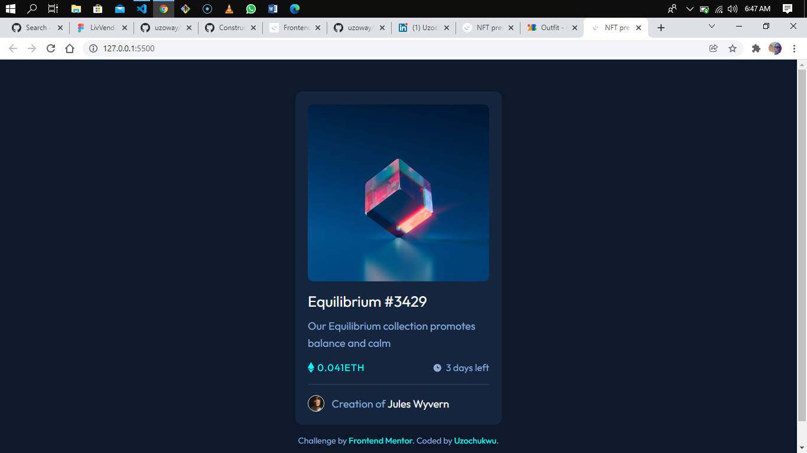

# NFT preview card component solution

This is a solution to the [NFT preview card component challenge on Frontend Mentor](https://www.frontendmentor.io/challenges/nft-preview-card-component-SbdUL_w0U). 

## Table of contents

- [Overview](#overview)
  - [The challenge](#the-challenge)
  - [Screenshot](#screenshot)
  - [Links](#links)
- [My process](#my-process)
  - [Built with](#built-with)
  - [What I learned](#what-i-learned)
  - [Continued development](#continued-development)
- [Author](#author)

## Overview

### The challenge

Users should be able to:

- View the optimal layout depending on their device's screen size
- See hover states for interactive elements

### Screenshot

### Links

- Solution URL: [Add solution URL here](https://your-solution-url.com)
- Live Site URL: [Add live site URL here](https://your-live-site-url.com)

## My process

### Built with

- Semantic HTML5 markup
- Flexbox
- Mobile-first workflow

### What I learned

I used this challenge to further improve my mobile-first workflow skills using SCSS which has led me to writing few media queries for my styling.

### Continued development

I am looking forward to improving my skills on writing more mobile-friendly websites by using the mobile-first workflow.

## Author

- LinkedIn - [Uzochukwu Victor Okafor](https://www.linkedin.com/in/uzochukwuokafor/)
- Frontend Mentor - [@uzoway](https://www.frontendmentor.io/profile/uzoway)
